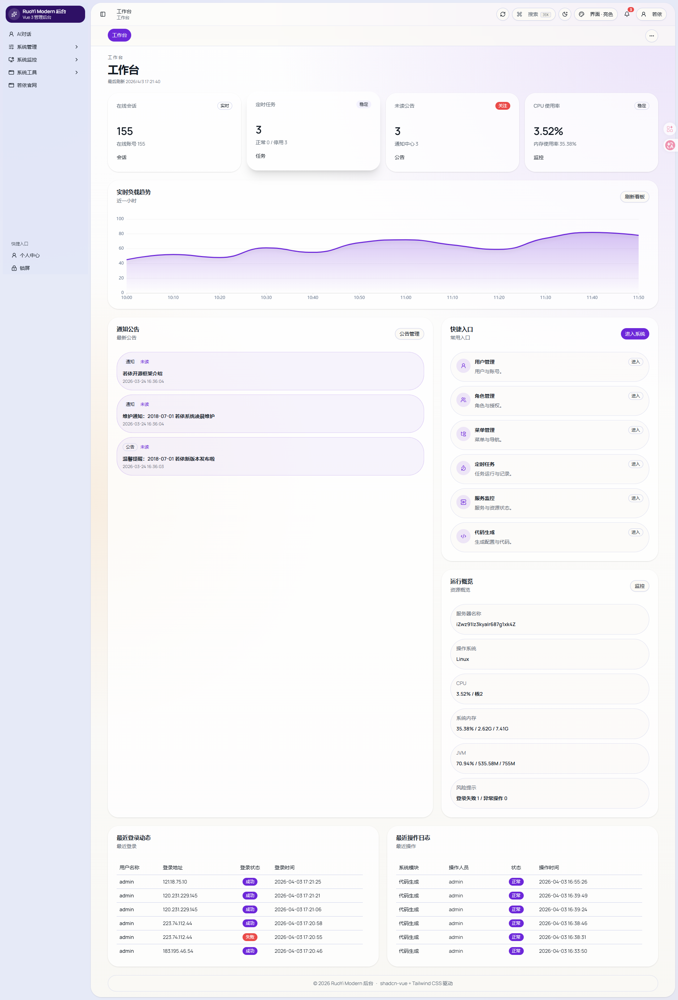
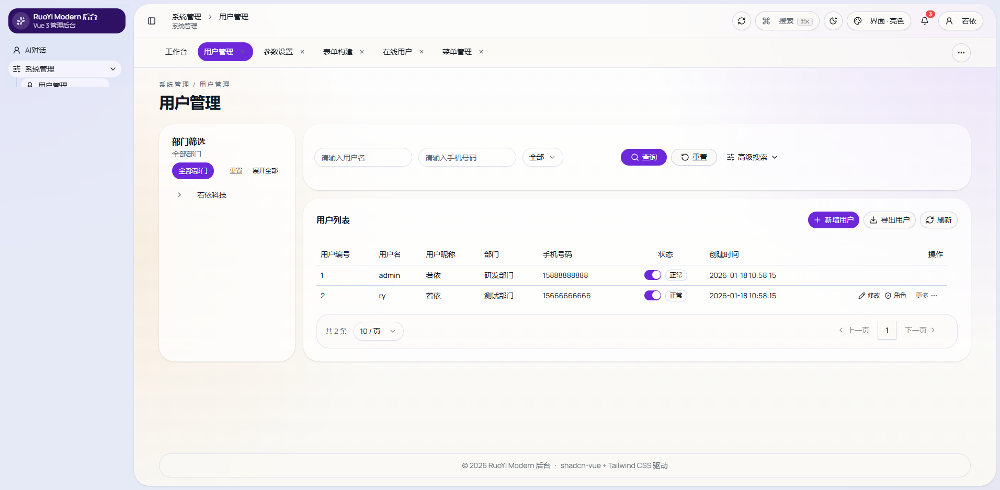

<div align="center">

# RuoYi Modern Admin

基于 **Vue 3 + TypeScript + shadcn-vue + Tailwind CSS v4** 重构的若依后台，仓库同时包含一套 **NestJS + Prisma** 配套后端。  
保留 **RuoYi-Vue3** 的管理工作流、接口语义和信息架构，同时用更现代的组件体系、主题系统和交互细节重做后台体验。

<p>
  
  
  
  
  
  
  
  
</p>

<p>
  <strong>不是简单换皮，而是一套可继续开发、可联调、可开源的现代若依后台工程。</strong>
</p>

</div>

---

## 项目预览

| 工作台 | 用户管理 |
| --- | --- |
|  |  |

## 项目定位

这个项目适合这几类场景：

- 想保留若依后台熟悉的权限、菜单、CRUD 工作流，但不再沿用旧前端视觉体系。
- 想使用 `shadcn-vue + Tailwind CSS` 做后台项目，又不想从 0 搭一套权限管理系统。
- 想让 Vue 3 前端和 Node/NestJS 后端一起协同工作，而不是继续绑定 Java 技术栈。

## 仓库结构

这是一个前后端一体仓库：

- `src/`：Vue 3 管理后台前端
- `apps/server/`：NestJS 配套后端
- `docs/`：交付说明、架构蓝图、截图等文档

## 前端亮点

- 完整接入若依登录、菜单、权限、`/getInfo`、`/getRouters` 与主要系统接口。
- 核心页面已经改成真实业务页，不再依赖统一配置渲染器。
- 主题系统支持明暗模式、主题色、圆角、布局模式与持久化。
- 标签页、右键菜单、刷新当前页、旧路径兼容、隐藏业务页路由都已经打通。
- 表格、查询区、弹窗、操作栏、日期选择、富文本、头像裁剪等都已抽成共享组件。
- 已针对移动端做专门收口，不只是桌面布局缩放。

## 后端亮点

- 使用 `NestJS + Prisma` 对齐若依后台接口契约。
- 数据库可用时走真实数据；数据库不可用时自动回退到 mock，方便联调。
- 已覆盖认证、系统管理、监控、工具、上传、导出、Swagger、Druid 兼容页。
- 代码生成支持预览、导入表、压缩下载等链路。

## 已覆盖模块

### 系统管理

- 用户管理
- 角色管理
- 菜单管理
- 部门管理
- 岗位管理
- 字典管理 / 字典数据
- 参数设置
- 通知公告
- 个人中心
- 分配角色 / 分配用户

### 系统监控

- 在线用户
- 登录日志
- 操作日志
- 定时任务
- 调度日志
- 服务监控
- 缓存监控
- 缓存列表
- Druid 兼容页

### 系统工具

- 代码生成
- 代码生成编辑
- Swagger
- 表单构建

### 其他能力

- 登录 / 注册 / 锁屏 / 401 / 404
- 公告中心
- 顶部 TagsView
- 动态主题与布局设置
- 富文本编辑器
- 头像裁剪上传

## 技术栈

### Frontend

- Vue 3
- TypeScript
- Vite 6
- Pinia
- Vue Router
- Tailwind CSS v4
- shadcn-vue / Reka UI
- TanStack Vue Table
- Tiptap
- vue-cropper
- vue-sonner
- ECharts / vue-echarts

### Backend

- NestJS 11
- Prisma 6
- MySQL
- Redis
- Swagger

## 快速开始

### 1. 安装依赖

```bash
pnpm install
```

### 2. 启动前端

复制根目录环境文件：

```bash
cp .env.example .env.development
```

默认前端会把 `/dev-api` 代理到本地 NestJS：`http://127.0.0.1:3000`。

启动前端：

```bash
pnpm dev
```

### 3. 启动后端

复制后端环境文件：

```bash
cp apps/server/.env.example apps/server/.env
```

生成 Prisma Client：

```bash
pnpm server:prisma:generate
pnpm server:prisma:push
pnpm server:seed
```

构建并启动后端：

```bash
pnpm server:build
pnpm server:start
```

### 4. 常用地址

- 前端开发环境：`http://127.0.0.1:5173`
- 后端 API：`http://127.0.0.1:3000`
- Swagger：`http://127.0.0.1:3000/docs`
- Druid 兼容页：`http://127.0.0.1:3000/druid/login.html`

## 常用命令

```bash
pnpm dev                     # 启动前端
pnpm build                   # 构建前端
pnpm server:prisma:generate  # 生成 Prisma Client
pnpm server:prisma:push      # 初始化或同步数据库结构
pnpm server:seed             # 写入基础演示数据
pnpm server:build            # 构建后端
pnpm server:start            # 启动后端
```

## 目录结构

```text
.
├─ apps/
│  └─ server/              # NestJS 后端
├─ docs/                   # 交付与设计文档
├─ public/
├─ src/                    # Vue 前端
│  ├─ api
│  ├─ components
│  │  ├─ admin
│  │  ├─ app
│  │  └─ ui
│  ├─ layout
│  ├─ lib
│  ├─ router
│  ├─ stores
│  ├─ theme
│  ├─ utils
│  └─ views
└─ README.md
```

## 动态路由与权限

- 菜单树以若依风格的 `/getRouters` 为主。
- 前端只保留少量必要的本地独立路由。
- 支持页面级权限、按钮级权限和隐藏页访问守卫。
- 兼容若依常见旧路径、隐藏页和后端 `component` 字符串变体。

## 当前边界

- `tool/build` 是增强版本地表单设计工作台，不是原版若依 1:1 同构实现。
- `druid` 在 NestJS 版本里是诊断页兼容实现，不是原版 Druid 控制台。
- 视觉上保留了现代化主题，不是原版 Element 风格复刻。
- `apps/server` 当前适合联调和二开，生产落地前仍建议接真实数据库初始化、迁移和部署流程。

## 验收建议

1. 登录 / 注册 / 锁屏 / 401 / 404
2. 动态菜单、标签页、面包屑、旧路径直达
3. 用户、角色、菜单、部门、岗位、字典、参数、公告 CRUD
4. 在线用户、登录日志、操作日志、定时任务、缓存监控、服务监控
5. 代码生成、Swagger、Druid、表单构建
6. 主题切换、布局设置、移动端适配

## 文档

- [设计需求文档](./docs/design-requirements.md)
- [开发与维护规范](./docs/development-maintenance-guide.md)
- [贡献指南](./CONTRIBUTING.md)
- [部署方案文档](./docs/deployment-runtime-guide.md)
- [部署与初始化文档](./docs/deployment-initialization-guide.md)
- [发布清单](./docs/release-checklist.md)
- [交付状态](./docs/delivery-status.md)
- [Nest 后端蓝图](./docs/nest-backend-blueprint.md)
- [后端子工程说明](./apps/server/README.md)
- [GitHub 仓库设置建议](./docs/github-repository-setup.md)
- [首版发布说明](./docs/release-notes-v1.0.0.md)
- [最终联调清单（精简版）](./docs/final-acceptance-checklist.md)
- [GitHub Release 正文（v1.0.0）](./docs/github-release-body-v1.0.0.md)
- [GitHub 仓库信息速查](./docs/github-publishing-snippets.md)
- [GitHub 发布操作手册](./docs/github-release-runbook.md)
- [更新日志](./CHANGELOG.md)
- [安全策略](./SECURITY.md)
- [社区行为准则](./CODE_OF_CONDUCT.md)

## 开源协议

本项目使用 [Apache License 2.0](./LICENSE) 开源发布。

## 鸣谢

- [RuoYi-Vue3](https://github.com/yangzongzhuan/RuoYi-Vue3)
- [RuoYi](https://github.com/yangzongzhuan/RuoYi)
- [shadcn-vue](https://github.com/unovue/shadcn-vue)
- [Tailwind CSS](https://tailwindcss.com/)
- [Reka UI](https://reka-ui.com/)
- [Tiptap](https://tiptap.dev/)
- [vue-cropper](https://github.com/xyxiao001/vue-cropper)
